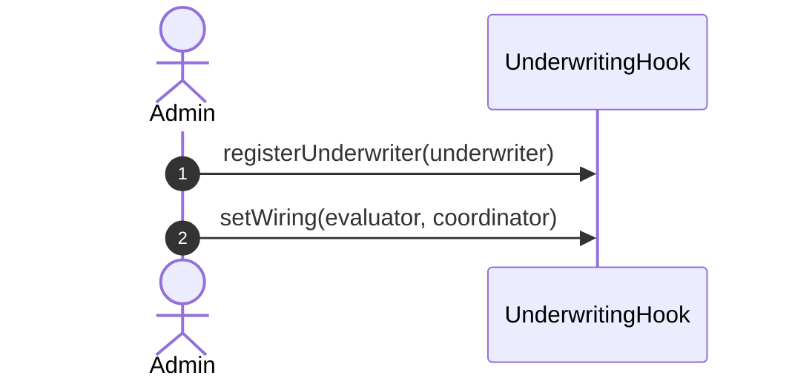
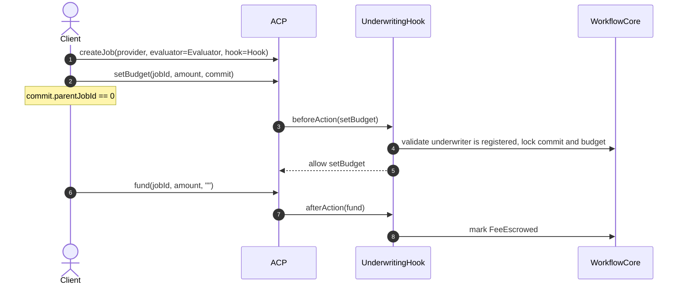
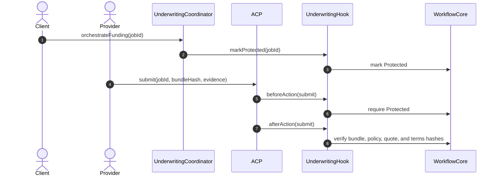
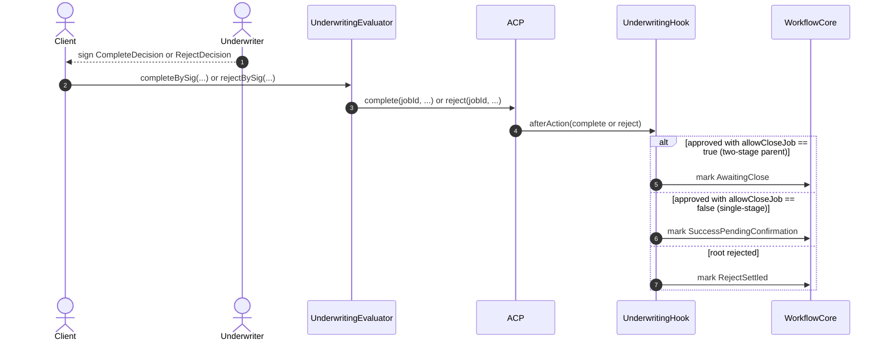
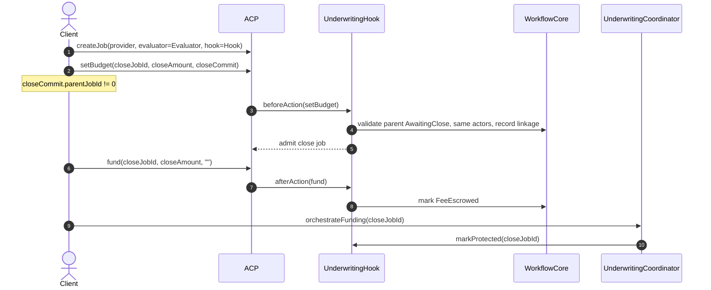
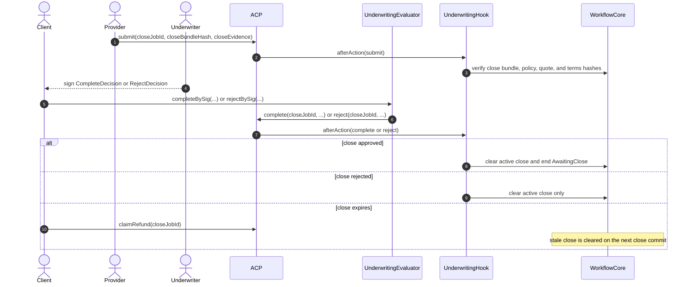

# Underwriting Hook Example Sequence

This document describes the current underwriting scaffold in `hook-contracts`.
`underwriting-settlement-contracts` is a separate companion implementation that
adds the economic layer around this workflow, including client-paid
underwriting premiums, provider collateral deposits, and dispute handling.
This scaffold intentionally stays narrower, but it uses the same high-level
split:

- `AgenticCommerceHooked` keeps the ACP job rail and fee escrow.
- `UnderwritingHook` is the ACP-facing hook shell plus admin/view surface.
- `UnderwritingWorkflowCore` is the internal underwriting workflow state behind
  the hook.
- `UnderwritingEvaluator` verifies underwriter signatures and calls ACP
  `complete()` / `reject()`.
- `UnderwritingCoordinator` advances funded jobs into the `Protected` sidecar
  phase before submission.

This scaffold still does **not** implement underwriting premium, provider
collateral, client principal deployment, dispute windows, or settlement sidecar
money movement.

To keep GitHub rendering readable, this page uses several smaller sequence
diagrams instead of one large all-in-one chart.

For the broader sidecar-oriented reviewer deep dive, see
`docs/underwriting-hook-sidecar-sequence.md`.

## Business-Level Sequence Diagrams

### 1. Setup

### 2. Root Job Request and Fee Funding

The `createJob(...)` ACP call is identical for all three job types. **The
commit payload encoded in `setBudget(...)` is the sole discriminator.** The
hook decodes the `UnderwriteCommit` struct from the `optParams` and branches
on two fields:

| Scenario | `parentJobId` | `allowCloseJob` |
|---|---|---|
| Single-stage root job | `0` | `false` |
| Two-stage parent job | `0` | `true` |
| Close job for existing parent | `!= 0` (parent's jobId) | `false` |

This section covers the first two rows (root jobs). Close-job admission is
described in §5.

For root jobs (`parentJobId == 0`) the hook validates that the named
`underwriter` is in the registered allowlist and locks the commit. Whether the
root job is single-stage or the parent of a two-stage flow only matters later
at completion time (§4), when `allowCloseJob` determines whether the job
enters `AwaitingClose` or `SuccessPendingConfirmation`.

### 3. Root Job Protection and Submission

### 4. Root Job Decision

For readability, the diagrams show the `Client` relaying the signature, though
any caller may relay `completeBySig(...)` or `rejectBySig(...)`.

This is where the `allowCloseJob` flag — committed at `setBudget` time (§2) —
finally takes effect. `_postCompleteWorkflow` checks `parentJobId == 0 &&
allowCloseJob`:

- **true** → the root job becomes a two-stage parent and enters
  `AwaitingClose`, which enables a future close job to reference it (§5).
- **false** (with `parentJobId == 0`) → single-stage; goes straight to
  `SuccessPendingConfirmation`.

`UnderwritingEvaluator.completeBySig(...)` and `rejectBySig(...)` intentionally
operate only after the provider has submitted evidence and the hook has marked
the job `EvidenceSubmitted`. This scaffold therefore does **not** expose an
evaluator-driven reject path from the `Funded` state; before submission, the
practical escape hatches are client-side rejection while the job is still
`Open`, or `claimRefund()` after expiry once the job has been funded.

### 5. Close Job Admission and Protection

A close job is just another `createJob(...)` → `setBudget(...)` sequence, but
its commit payload carries `parentJobId != 0` (pointing to the approved parent
from §4). This triggers the close-job branch of the same
`_preSetBudgetWorkflow` described in §2. Instead of checking the underwriter
registry, the hook validates:

- the parent is in `AwaitingClose` state,
- the actors (client, provider, evaluator, hook) and underwriter match the
  parent,
- no other live close job already occupies the parent's active-close slot.

If the client rejects the close job while it is still `Open`, the hook clears
the reserved close slot and the parent remains `AwaitingClose`.

### 6. Close Job Submission and Outcome

## Scope Notes

- The ACP budget is the only on-chain fee bucket in this scaffold.
- `UnderwritingWorkflowCore` tracks commit admission, sidecar state, evidence
  matching, and parent/close linkage only.
- A committed job may still be rejected while `Open`; that is the escape hatch
  for cancelling an abandoned root or close job before funding.
- Evaluator-driven underwriting decisions begin only after submission; this
  scaffold intentionally does not support an evaluator-signed reject from the
  `Funded` state before evidence has been submitted.
- Reviewers looking for premium, collateral, principal deployment, or dispute
  settlement behavior should treat those as part of the separate
  `underwriting-settlement-contracts` companion implementation, not this
  scaffold.
